# Hướng dẫn chơi MU Web

> Tài liệu cho **người chơi**. Mọi con số lấy từ dữ liệu game hiện tại (`priv/game_data/`, `priv/maps/`).
> Khi dữ liệu đổi, số trong game có thể khác tài liệu này. Giờ trong game tính theo **UTC** (Việt Nam = UTC + 7).
>
> Hướng dẫn cài đặt / chạy server: xem `docs/RUN_LOCAL.md`.

## Mục lục

1. [Bắt đầu](#1-bắt-đầu)
2. [Màn hình và điều khiển](#2-màn-hình-và-điều-khiển)
3. [Lớp nhân vật và kỹ năng](#3-lớp-nhân-vật-và-kỹ-năng)
4. [Cấp độ, điểm chỉ số, hồi phục](#4-cấp-độ-điểm-chỉ-số-hồi-phục)
5. [Bản đồ, NPC, quái](#5-bản-đồ-npc-quái)
6. [Chiến đấu](#6-chiến-đấu)
7. [Đồ, túi, kho, cửa hàng](#7-đồ-túi-kho-cửa-hàng)
8. [Ép đồ bằng Jewel](#8-ép-đồ-bằng-jewel)
9. [Chaos Machine và cánh](#9-chaos-machine-và-cánh)
10. [Nhiệm vụ](#10-nhiệm-vụ)
11. [Sự kiện thế giới](#11-sự-kiện-thế-giới)
12. [PvP, PK, Thách đấu](#12-pvp-pk-thách-đấu)
13. [Nhóm, Guild, Guild War](#13-nhóm-guild-guild-war)
14. [Giao dịch, Hộp thư, Xếp hạng, Chat](#14-giao-dịch-hộp-thư-xếp-hạng-chat)
15. [Mẹo cho người mới](#15-mẹo-cho-người-mới)
16. [Câu hỏi thường gặp](#16-câu-hỏi-thường-gặp)

---

## 1. Bắt đầu

### 1.1 Tài khoản

- Mở trang game, chọn **"Chưa có tài khoản? Đăng ký"**.
- Tên tài khoản: 3–32 ký tự, chỉ chữ không dấu, số, dấu `_`.
- Mật khẩu: 8–72 ký tự.
- Đăng nhập sai nhiều lần sẽ bị chặn tạm thời (tối đa 10 lần / tên / 5 phút).
- **Một tài khoản chỉ có một nhân vật trong game cùng lúc.** Đăng nhập ở máy khác sẽ đẩy phiên cũ ra
  ("Tài khoản đã vào game ở nơi khác").

### 1.2 Nhân vật

- Mỗi tài khoản tối đa **4 nhân vật**. Hiện **chưa xóa được nhân vật**, hãy đặt tên cẩn thận.
- Tên nhân vật: 4–10 ký tự, chỉ chữ không dấu và số.
- 4 lớp: **Dark Knight (DK)**, **Dark Wizard (DW)**, **Fairy Elf (ELF)**, **Magic Gladiator (MG)**.
- **MG bị khóa** ("🔒 cần nhân vật cấp 20") cho tới khi tài khoản có ít nhất một nhân vật đạt **cấp 20**.
- Nhân vật mới bắt đầu ở **Lorencia (15, 31)**, 0 Zen, kèm đồ khởi đầu:

| Lớp | Đồ khởi đầu |
|---|---|
| DK | (không có) |
| DW | Skull Staff |
| ELF | Short Bow |
| MG | Short Sword |

- Khi tạo nhân vật bạn nhận thư chào mừng trong 📬 Hộp thư.

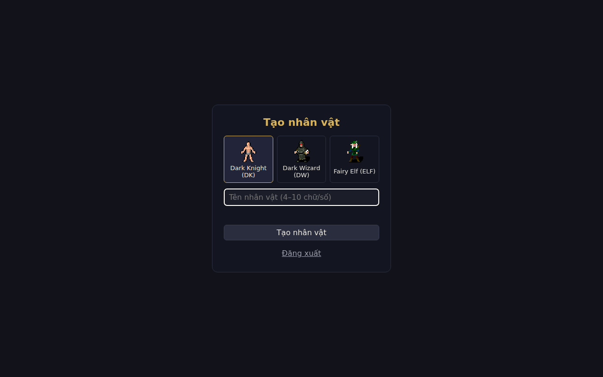

### 1.3 Đổi nhân vật / thoát

- **☰ Menu → 👥 Đổi nhân vật**: về màn chọn nhân vật, không cần đăng nhập lại.
- **☰ Menu → 🚪 Đăng xuất** (hoặc trong ⚙️ Cài đặt).
- Thoát khi **đang đánh nhau**: nhân vật còn ở lại thế giới **10 giây**.
- **Mất mạng**: nhân vật đứng tại chỗ **30 giây** (vẫn có thể bị đánh). Vào lại trong thời gian này thì tiếp tục bình thường.

---

## 2. Màn hình và điều khiển

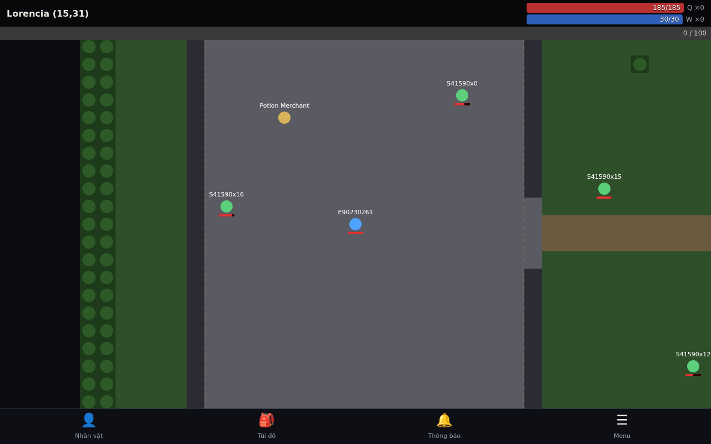

### 2.1 HUD

- Góc trên: tên map + tọa độ (x, y), nút 📬 Hộp thư (có số thư chưa đọc).
- Thanh **HP** (đỏ), **MP** (xanh), **EXP** (`exp / cần`, cấp tối đa hiện **MAX**).
- Bên cạnh thanh máu: số bình **Q ×n** (HP) và **W ×n** (MP).
- Biểu tượng buff đang có kèm thời gian: 🛡 tăng phòng thủ, ⚔ tăng sát thương.
- Các khung khi cần: khung nhóm, thanh thách đấu, thanh guild war, theo dõi nhiệm vụ (bấm để mở panel Nhiệm vụ),
  thanh sự kiện thế giới.

### 2.2 Thanh tab dưới

| Tab | Mở |
|---|---|
| 👤 Nhân vật | chỉ số, cộng điểm, trạng thái PK |
| 🎒 Túi đồ | trang bị đang mặc, túi 8×8, Zen |
| 🗺️ Bản đồ | bản đồ nhỏ, danh sách cổng |
| 🔔 Thông báo | lịch sử thông báo (lọc Tất cả / Chưa đọc, Xóa tất cả) |
| ☰ Menu | 🛡 Guild, 📜 Nhiệm vụ, 🏆 Xếp hạng, ⚙️ Cài đặt (bật / tắt âm thanh), 👥 Đổi nhân vật, 🚪 Đăng xuất |

Bấm lại tab đang mở để đóng panel.

### 2.3 Bàn phím (máy tính)

| Phím | Tác dụng |
|---|---|
| **C** | mở / đóng Nhân vật |
| **I** | mở / đóng Túi đồ |
| **M** | mở / đóng Bản đồ |
| **Q** | dùng bình HP |
| **W** | dùng bình MP |
| **Space** | nhặt món đồ gần nhất (trong 1 ô) |
| **Enter** | mở ô chat (khi không mở panel nào); trong ô chat: Enter gửi, Esc đóng |
| **Esc** | đóng theo thứ tự: chế độ ép jewel → chọn ô Teleport → menu → tooltip → panel |

- Không có phím số / thanh kỹ năng: **kỹ năng chọn qua menu khi bấm vào mục tiêu** (mục 6.1).
- Phím tắt không chạy khi đang gõ chữ.

### 2.4 Chuột / chạm

| Bấm vào | Kết quả |
|---|---|
| **Mặt đất** | đi tới đó (tự tìm đường, 5 ô / giây) |
| **Quái** | menu: *Tấn công thường*, các kỹ năng đã học, *Hủy* |
| **NPC** | đi tới gần (≤ 3 ô) rồi mở chức năng của NPC |
| **Đồ dưới đất** | đi tới và nhặt |
| **Người chơi khác** | menu người chơi (mục 2.5) |
| **Chính mình** | kỹ năng hỗ trợ lên bản thân, Teleport (DW) |

- Đi xa NPC quá 3 ô thì panel của NPC tự đóng.

### 2.5 Menu người chơi

Bấm vào người chơi khác, menu hiện những mục phù hợp:

- **⚔ Tấn công** và **⚔ <kỹ năng>**: chỉ khi được phép PvP (mục 12).
- Kỹ năng hỗ trợ (Heal, buff của ELF).
- **🤺 Thách đấu** (duel).
- **👥 Mời vào nhóm**: khi bạn chưa có nhóm hoặc là trưởng nhóm.
- **🛡 Mời vào guild**: khi bạn là chủ / phó guild và người kia chưa có guild.
- **🤝 Giao dịch**.
- **🚶 Đi tới đây**, **Hủy**.

### 2.6 Điện thoại

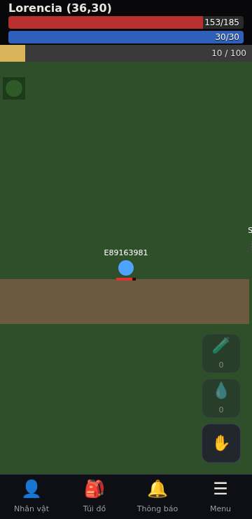

- Chạm như chuột. Màn hình ≤ 1023 px hiện thêm nút (ẩn khi đang mở panel):
  **🧪** bình HP (có số lượng) · **💧** bình MP · **✋** nhặt đồ · **💬** chat.
- Ép jewel trên điện thoại: chạm jewel → **[Ép lên…]** → chạm món đồ.

---

## 3. Lớp nhân vật và kỹ năng

### 3.1 Chỉ số khởi đầu

| Lớp | STR | AGI | VIT | ENE | Điểm / cấp | Lối chơi |
|---|---|---|---|---|---|---|
| **DK** | 28 | 20 | 25 | 10 | 5 | cận chiến, máu trâu |
| **DW** | 18 | 18 | 15 | 30 | 5 | phép xa, Teleport, đánh vùng |
| **ELF** | 22 | 25 | 20 | 15 | 5 | cung xa, hồi máu, buff đồng đội |
| **MG** | 26 | 26 | 26 | 26 | **7** | lai kiếm + phép, **không đội mũ** |

### 3.2 Chỉ số ảnh hưởng gì

| Chỉ số | DK | DW | ELF | MG |
|---|---|---|---|---|
| **STR** | sát thương (STR/6 ~ STR/4) | – | sát thương phụ (STR/14 ~ STR/8) | sát thương vật lý như DK |
| **AGI** | phòng thủ (AGI/4), tỉ lệ đánh trúng | phòng thủ (AGI/5) | sát thương chính (AGI/7 ~ AGI/4), phòng thủ (AGI/10) | phòng thủ (AGI/5) |
| **VIT** | +3 HP / điểm | +2 HP / điểm | +2 HP / điểm | +3 HP / điểm |
| **ENE** | +1 MP / điểm | sát thương phép (ENE/9 ~ ENE/4), +2 MP | +1,5 MP, sức mạnh Heal / buff | sát thương phép (tối đa ENE/4), +2 MP |

- Tỉ lệ đánh trúng (mọi lớp) = cấp × 5 + AGI × 1,5.
- Ngoài ra món đồ đeo phải đủ yêu cầu chỉ số (STR / AGI / ENE / cấp) mới mặc được.

### 3.3 Kỹ năng

Kỹ năng **tự học** khi đủ cấp. Bấm vào quái / người / bản thân để chọn.

| Kỹ năng | Lớp | Cấp | MP | Hồi chiêu | Tầm | Hiệu ứng |
|---|---|---|---|---|---|---|
| Tấn công thường | tất cả | 1 | 0 | theo tốc đánh | theo vũ khí | ×1,0 |
| Falling Slash | DK, MG | 5 | 6 | 0,9 s | 1 | ×1,6 |
| Twisting Slash | DK, MG | 10 | 10 | 0,8 s | 2 | vùng bán kính 2 quanh mình, ×1,2 |
| Death Stab | DK, MG | 18 | 12 | 1,2 s | 2 | ×2,0 |
| Energy Ball | DW, MG | 1 | 1 | theo tốc đánh | 4 | phép ×1,0 |
| Fire Ball | DW, MG | 5 | 3 | 1 s | 5 | phép ×1,5 |
| Lightning | DW, MG | 12 | 6 | 1,2 s | 5 | phép ×2,0 |
| Teleport | DW | 15 | 20 | 3 s | 6 | dịch chuyển tới ô chọn |
| Flame | DW | 18 | 15 | 1,5 s | 5 | vùng bán kính 2 tại điểm chọn, phép ×1,2 |
| Heal | ELF | 3 | 8 | 1,5 s | 4 | hồi 10 + ENE/4 HP cho đồng đội / bản thân |
| Triple Shot | ELF | 6 | 6 | 1 s | 5 | tối đa 3 mục tiêu quanh mục tiêu chính, ×0,8 |
| Greater Defense | ELF | 8 | 15 | 1,5 s | 4 | +phòng thủ (2 + ENE/8) trong 60 s |
| Greater Damage | ELF | 12 | 20 | 1,5 s | 4 | +sát thương (3 + ENE/7) trong 60 s |

- **Teleport:** bấm vào mình → Teleport → bấm ô đích (Esc để hủy).
- Tầm đánh thường: kiếm / gậy 1 ô, **cung 5 ô**. Cung là vũ khí hai tay, không cầm khiên cùng được.

---

## 4. Cấp độ, điểm chỉ số, hồi phục

- **Cấp tối đa: 30.** EXP cần để lên cấp kế tiếp = `100 × cấp^1,5` (làm tròn):

| Từ cấp | 1 | 2 | 5 | 10 | 15 | 20 | 25 | 29 |
|---|---|---|---|---|---|---|---|---|
| EXP cần | 100 | 283 | 1 118 | 3 162 | 5 809 | 8 944 | 12 500 | 15 617 |

  Tổng từ cấp 1 tới 30: 189 029 EXP.
- **Đánh quái quá thấp cấp:** nếu bạn cao hơn quái **trên 10 cấp**, mỗi cấp chênh thêm bớt 10 % EXP (còn tối thiểu 10 %).
- **Lên cấp** hồi đầy HP / MP và cho 5 điểm (MG 7 điểm).
- **Cộng điểm:** panel Nhân vật (phím C) → bấm **[+]** cạnh STR / AGI / VIT / ENE. **Không gỡ lại được.**
- **Hồi phục:**
  - HP **không tự hồi**. Dùng bình máu, Heal của ELF, hoặc lên cấp.
  - MP tự hồi **ENE / 40 mỗi giây**.
  - Bình thuốc có hồi chiêu 1 giây.

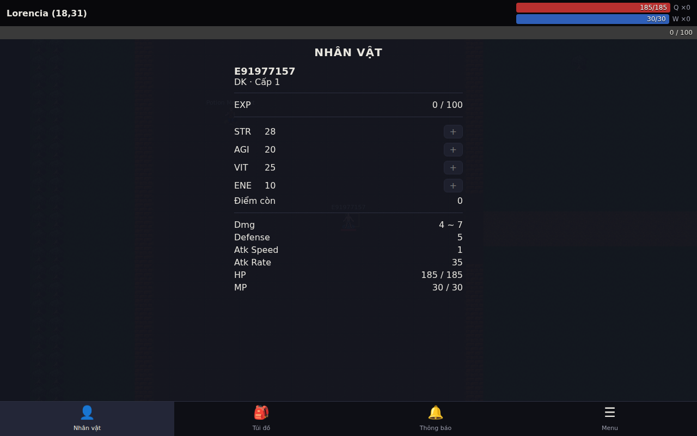

---

## 5. Bản đồ, NPC, quái

Mỗi map 64 × 64 ô. **Vùng an toàn** (khung vàng trên bản đồ nhỏ, thường là thị trấn):
quái không vào, không đánh người trong đó, không PvP.

### 5.1 Lorencia (map khởi đầu)

- Điểm hồi sinh: (15, 31). Thị trấn ở phía tây.
- **Cổng đi Noria:** (15–16, 8) phía bắc thị trấn, **cần cấp 10**.

| NPC | Vị trí | Chức năng |
|---|---|---|
| Potion Merchant | (11, 25) | bán bình HP / MP nhỏ |
| Weapon Merchant | (11, 37) | bán toàn bộ đồ t0 |
| Warehouse Keeper | (11, 31) | kho đồ |
| Quest Master | (19, 25) | nhận / trả nhiệm vụ |

| Quái | Cấp | HP | EXP | Zen | Khu vực (x, y) |
|---|---|---|---|---|---|
| Spider | 2 | 30 | 10 | 5–15 | phía đông thị trấn (42–58, 24–44) |
| Budge Dragon | 4 | 66 | 28 | 10–30 | đông bắc (40–61, 2–9) |
| Bull Fighter | 6 | 65 | 51 | 15–45 | đông bắc (40–61, 10–15) |
| Hound | 9 | 73 | 95 | 23–68 | tây nam (2–29, 45–61) |
| Lich (đánh xa 4 ô) | 11 | 92 | 128 | 28–83 | đông nam (34–61, 51–61) |
| Elite Bull Fighter | 13 | 117 | 164 | 33–98 | đông nam (34–61, 51–61) |

### 5.2 Noria

- Điểm hồi sinh: (31, 50). Thị trấn ở giữa phía nam.
- **Cổng về Lorencia:** (31–32, 61), không cần cấp.

| NPC | Vị trí | Chức năng |
|---|---|---|
| Potion Merchant | (26, 47) | bán bình nhỏ + vừa |
| Weapon Merchant | (37, 47) | bán toàn bộ đồ t1 |
| Warehouse Keeper | (26, 54) | kho đồ |
| Quest Master | (37, 54) | nhận / trả nhiệm vụ |
| **Chaos Goblin** | (37, 51) | **Chaos Machine** (mục 9) |

| Quái | Cấp | HP | EXP | Zen | Khu vực (x, y) |
|---|---|---|---|---|---|
| Goblin | 12 | 115 | 145 | 30–90 | tây nam (3–19, 40–60) |
| Chain Scorpion | 15 | 117 | 203 | 38–113 | đông nam (44–60, 40–60) |
| Beetle Monster | 18 | 105 | 267 | 45–135 | tây (3–24, 22–38) |
| Hunter (đánh xa 4 ô) | 20 | 98 | 313 | 50–150 | đông (40–60, 22–38) |
| Forest Monster | 23 | 125 | 386 | 58–173 | tây bắc (3–26, 3–19) |
| Agon | 26 | 124 | 464 | 65–195 | đông bắc (38–60, 3–19) |
| Stone Golem | 29 | 155 | 547 | 73–218 | bắc giữa (26–37, 3–12) |

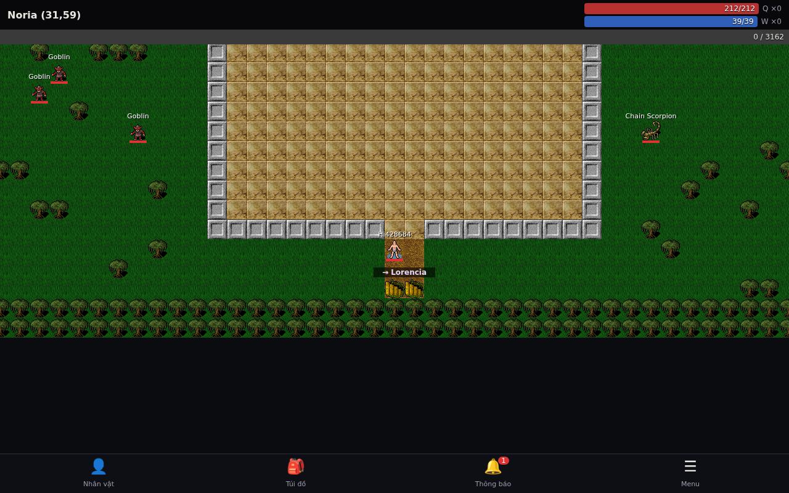

### 5.3 Lộ trình gợi ý

| Cấp | Nơi luyện |
|---|---|
| 1–4 | Spider (Lorencia) |
| 4–8 | Budge Dragon, Bull Fighter |
| 8–12 | Hound, Lich, Elite Bull Fighter |
| 12–18 | sang Noria: Goblin, Chain Scorpion |
| 18–25 | Beetle Monster, Hunter, Forest Monster |
| 25–30 | Agon, Stone Golem |

---

## 6. Chiến đấu

### 6.1 Đánh quái

1. Bấm vào quái → chọn **Tấn công thường** hoặc một kỹ năng.
2. Nhân vật **tự đánh liên tục** theo nhịp hồi chiêu, tự đi lại gần nếu xa.
3. Tự dừng khi quái chết / biến mất, hoặc khi bạn bấm đi chỗ khác.
4. Hết MP thì chuyển về đánh thường.

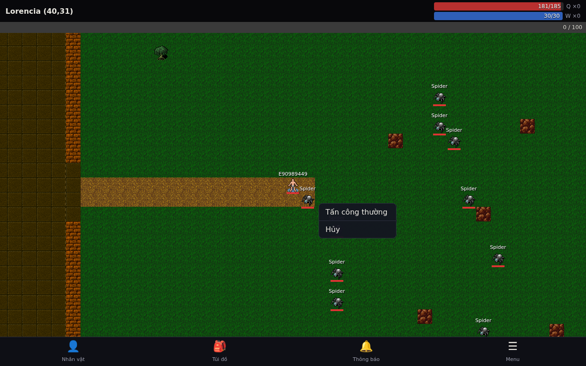

- Tỉ lệ trúng = tỉ lệ đánh trúng của bạn / (tỉ lệ đó + phòng thủ né của đối thủ), luôn trong khoảng 5 %–95 %.
- Hiện chưa có đòn chí mạng.

### 6.2 Phần thưởng và đồ rơi

- **EXP và Zen** thuộc về **người ra đòn cuối** (có nhóm thì EXP chia nhóm, mục 13.1).
- **Đồ rơi** thuộc về **người gây nhiều sát thương nhất** trong **10 giây** đầu (người cùng nhóm cũng nhặt được).
  Sau đó ai cũng nhặt được. Đồ dưới đất biến mất sau **60 giây**.
- Tỉ lệ rơi:
  - Bình thuốc 15 % mọi quái.
  - Trang bị 6 % (Spider) / 4 % (quái khác). Quái thấp rơi đồ t0, từ Lich trở lên rơi đồ t1.
  - **Jewel**: quái cấp ≥ 10 có 0,6 % (Bless phổ biến nhất, rồi Soul, Chaos, Life). Quái vàng 10 %, boss 50 %.
- Nhặt: **Space**, nút ✋, hoặc bấm vào món đồ.

### 6.3 Chết

- **Không mất EXP, không mất Zen** khi chết vì quái.
- Sau **3 giây** hồi sinh ở điểm hồi sinh của map hiện tại, đầy HP / MP.
- Bị người chơi giết có thể rơi đồ, xem mục 12.
- Chết làm hủy giao dịch đang mở.

---

## 7. Đồ, túi, kho, cửa hàng

### 7.1 Ô trang bị

Mũ · Áo · Quần · Găng · Giày · Vũ khí · Khiên · **Cánh** · Nhẫn 1 · Nhẫn 2.

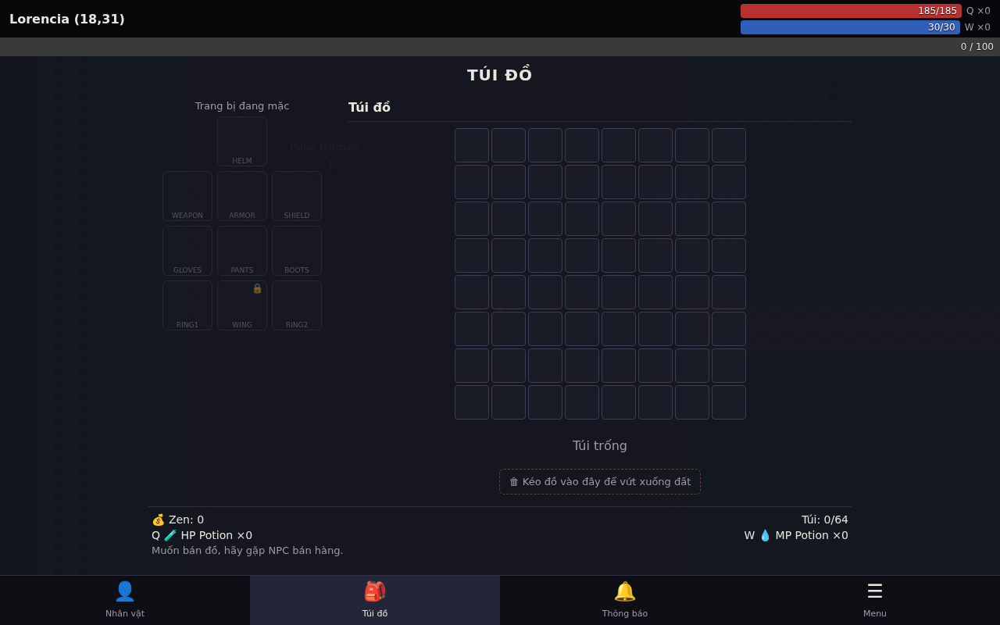

### 7.2 Túi đồ (phím I)

- Túi **8 × 8 = 64 ô**. Bình thuốc chồng tới 99, jewel tới 20.
- **Kéo thả** để xếp / mặc / tháo.
- **Bấm vào đồ** → tooltip với nút **[Trang bị] [Dùng] [Ép lên…] [Tách] [Vứt]**.
  Bấm đồ đang mặc → **[Tháo]**.
- **Vứt:** kéo vào ô 🗑, xác nhận "Vứt xuống đất?". Đồ bạn vứt vẫn giữ cho bạn 10 giây.
- Bình **Q / W** lấy từ chồng ở ô đầu tiên của loại đó.

### 7.3 Kho (Warehouse Keeper)

- **15 × 8 = 120 ô**, **dùng chung cho mọi nhân vật** cùng tài khoản: cách chuyển đồ giữa các nhân vật.
- Kéo thả, hoặc nút **[Gửi] / [Rút]**. **Không gửi Zen vào kho được.**

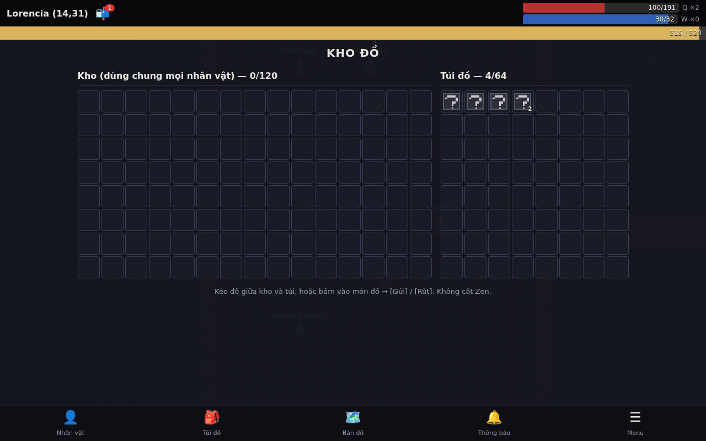

### 7.4 Cửa hàng

- Bấm món trong cửa hàng để **mua 1 cái**. Nút **[Bán]** cạnh đồ trong túi để bán.
- Giá bán lại = **50 % giá mua**.

**Bình thuốc**

| Món | Hồi | Giá mua | Nơi bán |
|---|---|---|---|
| Small Healing Potion | +50 HP | 100 | Lorencia, Noria |
| Small Mana Potion | +20 MP | 120 | Lorencia, Noria |
| Healing Potion | +120 HP | 300 | Noria |
| Mana Potion | +60 MP | 350 | Noria |

**Đồ t0 (Lorencia, Weapon Merchant)**

| Món | Chỉ số | Yêu cầu | Lớp | Giá |
|---|---|---|---|---|
| Short Sword | 3–7 | STR 21 | tất cả | 1 000 |
| Skull Staff | 3–6 | ENE 20 | DW, MG | 1 000 |
| Short Bow | 2–5 | AGI 20 | ELF | 1 000 |
| Small Shield | thủ 1 | STR 25 | | 800 |
| Bộ Leather (mũ / áo / quần / găng / giày) | thủ 5 / 10 / 7 / 2 / 2 | STR 28 | DK, MG (mũ chỉ DK) | 500 / 1 000 / 700 / 400 / 400 |
| Bộ Pad | thủ 3 / 6 / 4 / 1 / 1 | STR 10 | DW, MG (mũ chỉ DW) | như trên |
| Bộ Vine | thủ 4 / 8 / 5 / 2 / 2 | AGI 15 | ELF | như trên |

**Đồ t1 (Noria, Weapon Merchant, cần cấp 10)**

| Món | Chỉ số | Yêu cầu | Lớp | Giá |
|---|---|---|---|---|
| Rapier | 9–15 | STR 40 | DK, ELF, MG | 3 000 |
| Angelic Staff | 7–12 | ENE 40 | DW, MG | 3 000 |
| Bow | 6–11 | AGI 40 | ELF | 3 000 |
| Horn Shield | thủ 4 | STR 35 | | 2 400 |
| Bộ Bronze | thủ 8 / 16 / 12 / 4 / 4 | STR 40 | DK, MG | mũ 1 500, áo 3 000, quần 2 100, găng / giày 1 200 |
| Bộ Bone | thủ 5 / 10 / 7 / 2 / 2 | ENE 40 | DW, MG | như trên |
| Bộ Silk | thủ 6 / 13 / 9 / 3 / 3 | AGI 40 | ELF | như trên |

- **Ring of HP** (+20 HP): không bán ở cửa hàng, rơi từ quái khu t0, dùng cho nhiệm vụ "Chiếc nhẫn thất lạc".
- **Jewel** và **cánh** không bán ở cửa hàng (bán lại cho NPC được).
- Người chơi **Sát nhân** (PK đỏ) **không dùng được NPC** nào.

---

## 8. Ép đồ bằng Jewel

### 8.1 Các loại Jewel

| Jewel | Dùng để |
|---|---|
| **Bless** | ép +0 → +6 |
| **Soul** | ép +6 → +9 |
| **Chaos** | ép +9 → +11, nguyên liệu Chaos Machine |
| **Life** | thêm dòng tùy chọn (option) |

### 8.2 Cách ép

- **Kéo jewel thả lên món đồ** trong túi, hoặc bấm jewel → **[Ép lên…]** → bấm món đồ (Esc để hủy).
- Ép được: vũ khí, khiên, mũ / áo / quần / găng / giày, cánh. **Không ép được nhẫn.**

| Bước | Jewel | Thành công | Thất bại |
|---|---|---|---|
| +0 → +6 (từng cấp) | Bless | 100 % | – |
| +6 → +7 | Soul | 70 % | **tụt 1 cấp** |
| +7 → +8 | Soul | 60 % | tụt 1 cấp |
| +8 → +9 | Soul | 50 % | tụt 1 cấp |
| +9 → +10 | Chaos | 50 % | **MẤT ĐỒ** |
| +10 → +11 | Chaos | 45 % | **MẤT ĐỒ** |

- **+11 là tối đa.** Dùng sai loại jewel cho bước đó thì bị từ chối, không mất jewel.
- Ép thành công từ **+7** trở lên được thông báo hệ thống cho cả map.

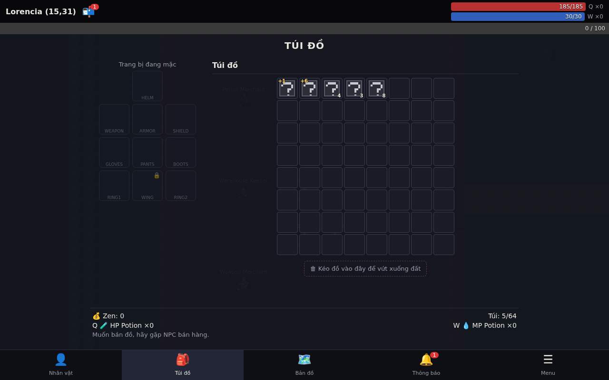

### 8.3 Mỗi cấp + cho gì

| Loại đồ | Mỗi cấp + |
|---|---|
| Vũ khí | +3 sát thương (cả min và max) |
| Khiên | +2 phòng thủ |
| Mũ / áo / quần / găng / giày | +3 phòng thủ |
| Cánh | +1 phòng thủ, +2 % sát thương, +2 % hấp thụ |

- Từ **+10**, mỗi cấp tính **gấp đôi** (+10 tương đương 11 cấp, +11 tương đương 13 cấp).
- Ép cấp **không đổi yêu cầu** để mặc.

### 8.4 Jewel of Life (option)

- Thành công 50 %, thất bại món đồ giữ nguyên.
- Tối đa **4 dòng**, mỗi dòng +4 sát thương (vũ khí) hoặc +4 phòng thủ (giáp / khiên).
- **Không dùng cho cánh.**

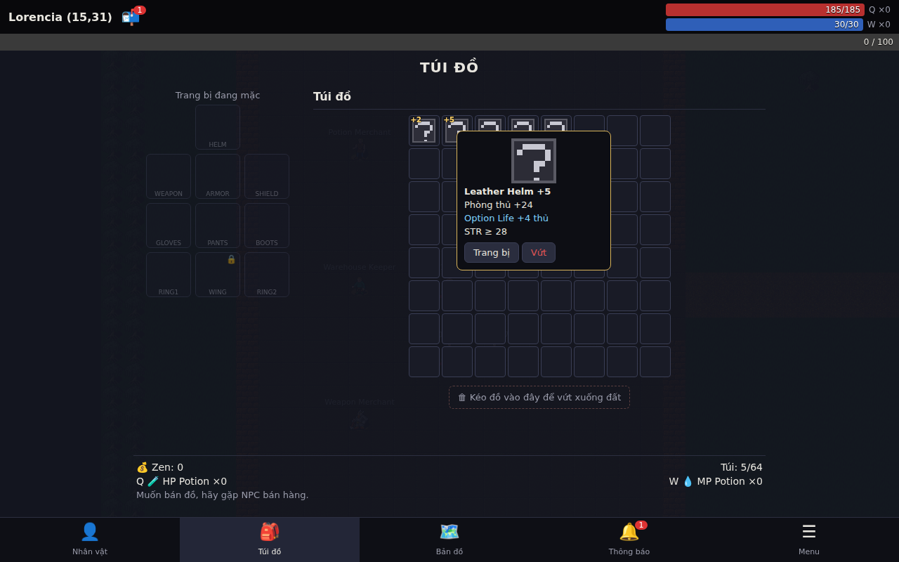

---

## 9. Chaos Machine và cánh

### 9.1 Cách dùng

1. Tới **Chaos Goblin** ở Noria (37, 51).
2. Bấm đồ trong túi để đặt vào máy (tối đa 8 món). Máy hiện công thức, tỉ lệ, phí Zen.
3. Bấm **⚗ Kết hợp**.

- **Thất bại mất hết nguyên liệu và phí Zen.**

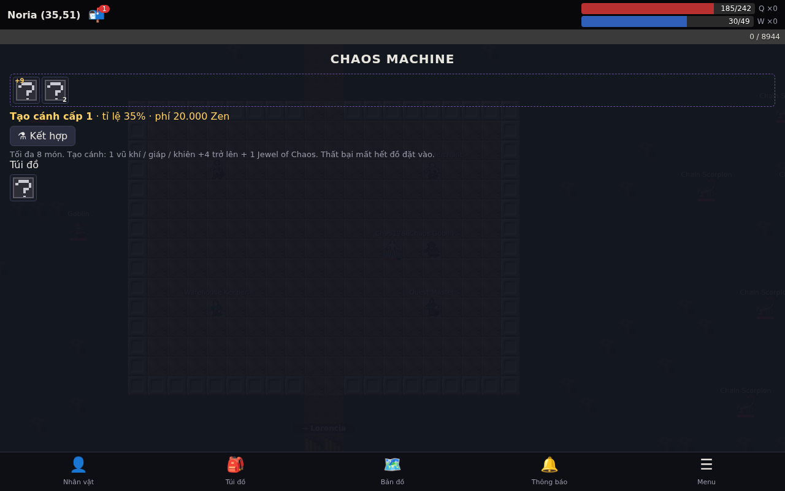

### 9.2 Công thức

| Công thức | Nguyên liệu | Phí | Tỉ lệ | Kết quả |
|---|---|---|---|---|
| **Cánh cấp 1** | 1 vũ khí / giáp / khiên **+4 trở lên** + 1 Jewel of Chaos | 20 000 Zen | 10 % + 5 % mỗi cấp trên +4 + 2 % mỗi dòng option, tối đa 60 % | ngẫu nhiên 1 trong 3 cánh cấp 1 |
| **Cánh cấp 2** | 1 cánh cấp 1 **+5 trở lên** + 5 Bless + 5 Soul + 2 Chaos | 200 000 Zen | 20 % + 5 % mỗi cấp trên +5, tối đa 60 % | cánh cấp 2 **đúng lớp người ghép** |

### 9.3 Các loại cánh

| Cánh | Lớp | Cấp mặc | Phòng thủ | Tăng sát thương | Hấp thụ |
|---|---|---|---|---|---|
| Wings of Elf | ELF | 15 | 10 | 12 % | 12 % |
| Wings of Heaven | DW, MG | 15 | 10 | 12 % | 12 % |
| Wings of Satan | DK, MG | 15 | 10 | 12 % | 12 % |
| Wings of Spirit | ELF | 25 | 20 | 20 % | 20 % |
| Wings of Soul | DW | 25 | 20 | 20 % | 20 % |
| Wings of Dragon | DK | 25 | 20 | 20 % | 20 % |
| Wings of Darkness | MG | 25 | 20 | 20 % | 20 % |

- **Tăng sát thương:** nhân thêm vào sát thương bạn gây ra.
- **Hấp thụ:** giảm sát thương nhận vào (sau khi trừ phòng thủ).
- Cánh cấp 1 ra ngẫu nhiên lớp: nếu ra cánh không hợp lớp, cất kho cho nhân vật khác hoặc giao dịch / bán.

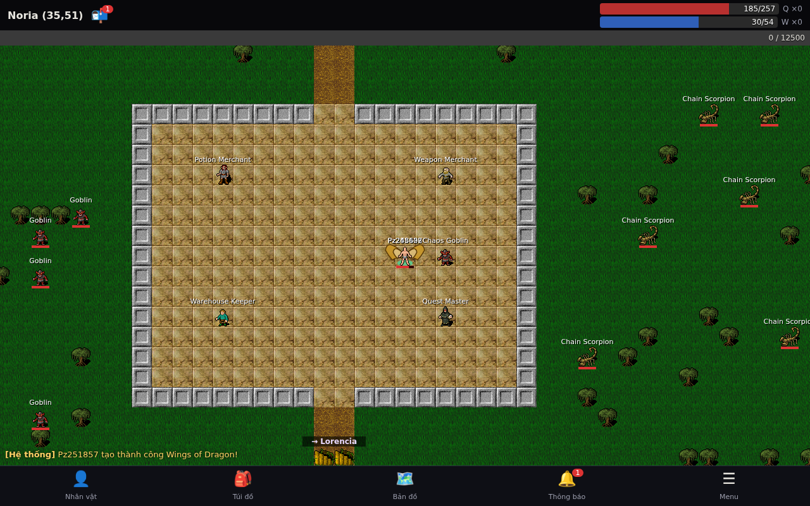

---

## 10. Nhiệm vụ

- Nhận / trả ở **Quest Master** (Lorencia (19, 25) hoặc Noria (37, 54), hai nơi như nhau).
- Panel **📜 Nhiệm vụ** (☰ Menu, hoặc bấm khung theo dõi trên màn hình) có 3 mục:
  "Đang làm", "Nhận được", "Đã hoàn thành".
- Tối đa **5 nhiệm vụ** cùng lúc. Mỗi nhiệm vụ chỉ làm **một lần**.
- **[Bỏ]** nhiệm vụ được ở bất kỳ đâu.
- Quái do **người cùng nhóm** hạ (bạn được chia EXP) cũng tính tiến độ.
- Nhiệm vụ thu thập: đồ bị nộp khi trả.

| Nhiệm vụ | Cấp | Mục tiêu | Thưởng |
|---|---|---|---|
| Diệt Nhện | 1 | 10 Spider | 100 EXP, 300 Zen, 5 bình HP nhỏ |
| Trưởng thành | 1 | đạt cấp 10 | 5 000 Zen, 5 Mana Potion |
| Rồng con Budge | 3 | 12 Budge Dragon | 300 EXP, 800 Zen, 5 bình MP nhỏ |
| Đấu sĩ Bò | 5 | 15 Bull Fighter | 600 EXP, 1 500 Zen, 10 bình HP nhỏ |
| Chiếc nhẫn thất lạc | 6 | nộp 1 Ring of HP | 800 EXP, 3 000 Zen |
| Bầy chó săn | 8 | 15 Hound | 1 200 EXP, 2 500 Zen, 5 Healing Potion |
| Yêu tinh Noria | 12 | 20 Goblin | 3 000 EXP, 4 000 Zen, 10 Healing Potion |
| Kẻ săn bị săn | 18 | 15 Hunter + nộp 10 Healing Potion | 5 000 EXP, 6 000 Zen |
| Thợ săn Noria | 22 | 20 Forest Monster | 7 000 EXP, 3 000 Zen, **1 Jewel of Bless** |
| Người khổng lồ đá | 26 | 15 Stone Golem + 10 Agon | 12 000 EXP, 10 000 Zen, **1 Jewel of Soul** |

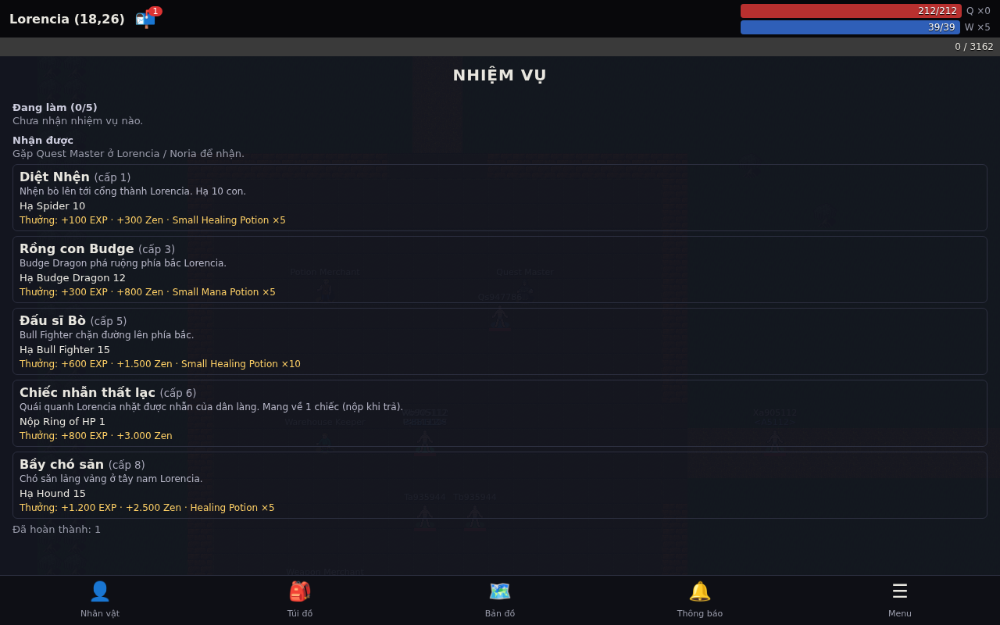

---

## 11. Sự kiện thế giới

- Thông báo hệ thống toàn server **5 phút trước**, lúc bắt đầu và lúc kết thúc.
- Thanh sự kiện giữa trên màn hình: "⏳ … sau mm:ss" (sắp bắt đầu), "⚔ … còn mm:ss" (đang diễn ra).
- Quái sự kiện **không hồi sinh**.

### 11.1 Golden Invasion

- **Giờ (UTC):** 00, 03, 06, 09, 12, 15, 18, 21 giờ, phút 0 — kéo dài **15 phút**.
  (Giờ Việt Nam: 7, 10, 13, 16, 19, 22, 1, 4 giờ.)
- 8 **Golden Budge Dragon** ở Lorencia (bãi Budge / Bull Fighter, đông bắc) và 8 **Golden Goblin** ở Noria (bãi Goblin, tây nam).
- Quái vàng nhiều máu hơn, cho **EXP / Zen gấp 5**, rơi jewel 10 %.
- Hạ hết quái vàng thì sự kiện kết thúc sớm.

### 11.2 World Boss — Bull Fighter Lord

- **Giờ (UTC):** mọi giờ **lẻ** (01, 03, 05, …, 23), phút 0 — kéo dài **20 phút**.
- Xuất hiện ở Lorencia, mép nam bãi Spider (khoảng 42–47, 46–49).
- Boss cấp 32, 20 000 HP, sát thương 60–90, **đánh vùng**: mỗi đòn trúng tới 6 người trong bán kính 2 ô. Người cấp thấp nên đứng xa.
- **Thưởng** chia theo phần sát thương (cần gây ít nhất **1 %** tổng sát thương):
  - tổng 6 000 EXP và 30 000 Zen chia theo tỉ lệ;
  - **top 3** mỗi người thêm 1 jewel ngẫu nhiên (rơi dưới đất, chỉ người đó nhặt được);
  - đồ rơi của boss thuộc người gây nhiều sát thương nhất.
- Hạ boss thì sự kiện kết thúc sớm.
- Lúc **03 UTC** cả hai sự kiện diễn ra cùng lúc.

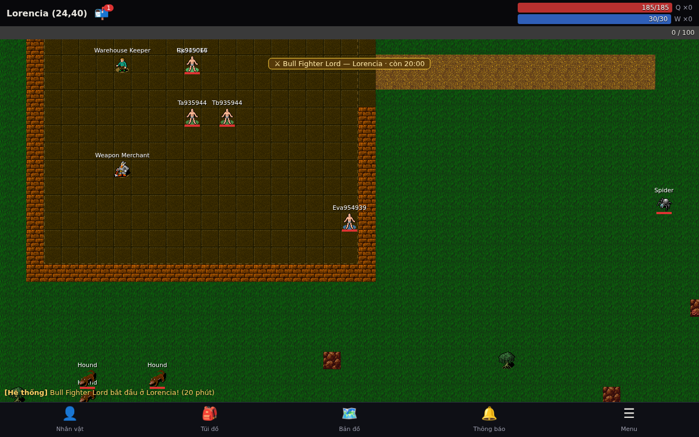

---

## 12. PvP, PK, Thách đấu

### 12.1 Đánh người chơi

- Cả hai phải **cấp 6 trở lên** và **không ai đứng trong vùng an toàn**.
- Sát thương lên người chơi **× 0,5**.
- **Không đánh được người cùng nhóm.**
- Kỹ năng vùng chỉ trúng quái, đối thủ thách đấu, và thành viên guild địch khi đang guild war.
- Hạ người chơi **không** cho EXP / Zen.
- Lần đầu đánh một người bình thường, game hỏi xác nhận vì bạn sẽ thành người có PK.

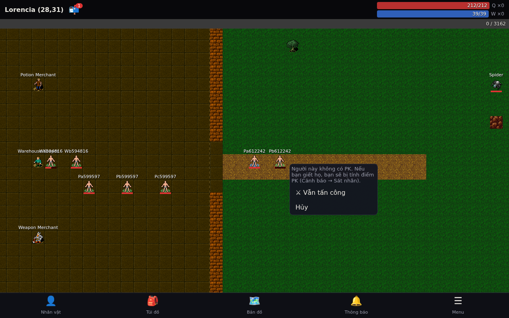

### 12.2 Điểm PK

| Trạng thái | Điểm PK | Tên |
|---|---|---|
| Bình thường | 0 | trắng |
| Cảnh báo | 1 | **cam** |
| **Sát nhân** | 2+ | **đỏ** |

- Giết một người **bình thường** (không phải tự vệ) → +1 điểm PK.
- **Kẻ gây sự:** khi bạn đánh một người bình thường, tên bạn **nhấp nháy cam**. Người đó được **tự vệ 30 giây**
  (mỗi đòn bạn đánh làm mới thời gian): họ đánh / giết lại bạn không bị PK.
- Giết người Cảnh báo / Sát nhân, hoặc giết khi tự vệ: không bị PK.
- Điểm PK giảm 1 sau mỗi **60 phút** (giờ thật).
- **Bị người chơi giết thì có thể rơi 1 món ngẫu nhiên trong túi:**

| Trạng thái người chết | Tỉ lệ rơi đồ |
|---|---|
| Bình thường | 0 % |
| Cảnh báo | 10 % |
| Sát nhân | 50 % |

- **Sát nhân không dùng được NPC** (cửa hàng, kho, nhiệm vụ, Chaos Machine): phải chờ điểm PK giảm.

### 12.3 Thách đấu (Duel)

- Menu người chơi → **🤺 Thách đấu**. Người kia ở trong 10 ô, có 30 giây để nhận.
- Không thách đấu trong vùng an toàn. Người ngoài không xen vào được.
- **Thua** khi: HP về 0 (giữ lại 1 HP), đầu hàng, rời map, mất kết nối,
  hoặc là người ở xa điểm bắt đầu hơn khi hai người cách nhau quá 20 ô.
- Hết **3 phút** → hòa.
- Không PK, không rơi đồ, không thưởng.

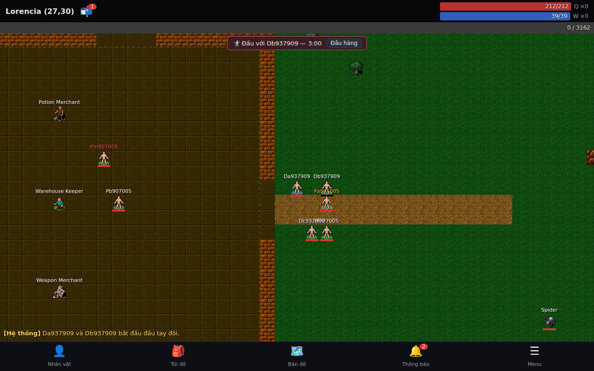

---

## 13. Nhóm, Guild, Guild War

### 13.1 Nhóm (Party)

- Menu người chơi → **👥 Mời vào nhóm**. Tối đa **5 người**. Chỉ trưởng nhóm mời được.
- **Chia EXP:** thành viên cùng map, còn sống, trong 20 ô quanh quái đều nhận
  `EXP / số người × (1 + 0,1 × (số người − 1))`. Ví dụ nhóm 5 người: mỗi người 28 % EXP của con quái (tổng 140 %).
- Zen vẫn cho người ra đòn cuối. Đồ rơi của bạn thì cả nhóm nhặt được.
- Trưởng nhóm rời → người vào sớm nhất lên thay. Còn 1 người thì nhóm giải tán.
- Chat nhóm: `/p nội dung`.

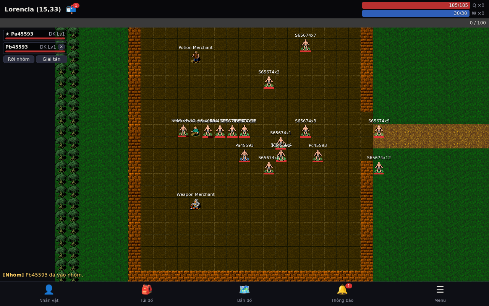

### 13.2 Guild

- Tạo guild (☰ → 🛡 Guild): cần **cấp 20** và **10 000 Zen**. Tên 3–8 ký tự chữ / số, không trùng.
- Tối đa **20 thành viên**, **2 phó guild**.

| Việc | Chủ guild | Phó guild | Thành viên |
|---|---|---|---|
| Mời người | ✔ | ✔ | |
| Đuổi | mọi người | chỉ thành viên | |
| Phong / hạ phó, giải tán, tuyên chiến | ✔ | | |
| Rời guild | không (phải giải tán) | ✔ | ✔ |

- Tên guild hiện trên đầu nhân vật. Chat guild: `/g nội dung`.

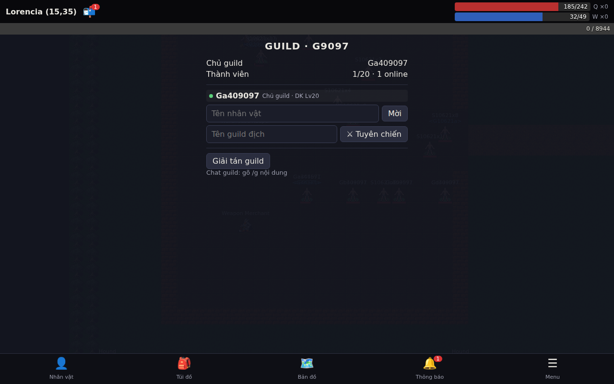

### 13.3 Guild War

- Chủ guild tuyên chiến trong panel Guild. Chủ guild bên kia có **60 giây** để nhận.
- Trong war, thành viên hai guild đánh nhau ngoài vùng an toàn (vẫn cần cấp 6), tên địch hiện **tím**.
  Mỗi lần hạ địch +1 điểm, **không PK, không rơi đồ**.
- Kết thúc khi một bên đạt **20 điểm**, hết **30 phút** (điểm cao hơn thắng, bằng nhau hòa), một bên đầu hàng
  hoặc giải tán guild.
- Không có thưởng.

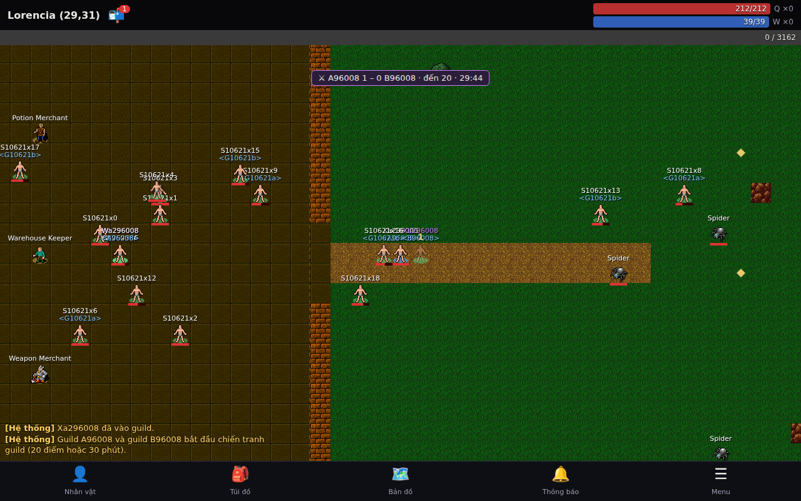

---

## 14. Giao dịch, Hộp thư, Xếp hạng, Chat

### 14.1 Giao dịch

1. Menu người chơi → **🤝 Giao dịch**: hai người cùng map, cách nhau ≤ 5 ô, còn sống, không đang thách đấu.
2. Đưa đồ từ túi (tối đa 16 món, nguyên chồng) và nhập Zen.
3. Cả hai bấm **🔒 Khóa**, xem kỹ bàn bên kia, rồi bấm **✔ Đồng ý**.

- Mọi thay đổi sau khi khóa sẽ mở khóa cả hai bên.
- Giao dịch bị hủy khi: bấm Hủy, đi xa quá 10 ô, đổi map, chết, mất kết nối, hoặc quá 3 phút.

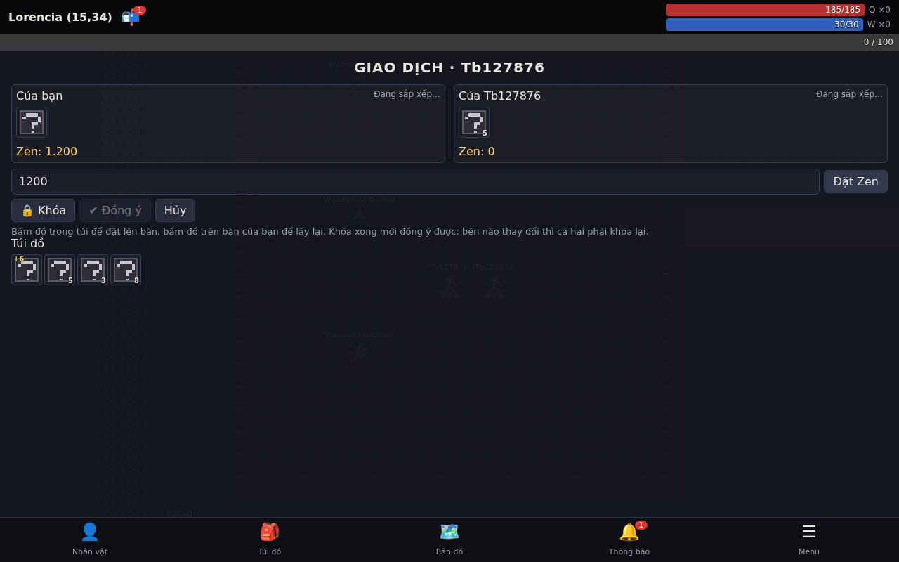

### 14.2 Hộp thư (📬)

- Thư hệ thống / quà từ quản trị viên. Bấm **[Nhận]** để lấy quà (Zen, đồ) vào túi.
- Lọc Tất cả / Chưa đọc / Có quà; **Xóa đã đọc**.
- Thư hết hạn sau **30 ngày**, tối đa 100 thư mỗi nhân vật.

### 14.3 Xếp hạng (☰ → 🏆)

- Bảng: Tất cả, DK, DW, ELF, MG (theo cấp, rồi EXP) và Guild (tổng cấp thành viên).
- Top 50, cập nhật mỗi **5 phút**. Hiện cả hạng của bạn.

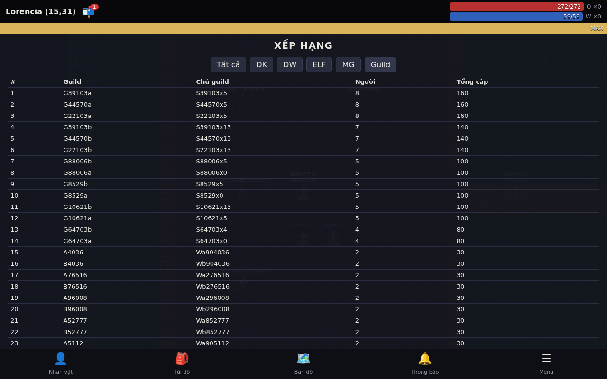

### 14.4 Chat

| Gõ | Gửi tới |
|---|---|
| `nội dung` | mọi người **cùng map** |
| `/w Tên nội dung` hoặc `/m Tên nội dung` | thì thầm (người đó phải online) |
| `/p nội dung` | nhóm |
| `/g nội dung` | guild |

- Tối đa 100 ký tự / tin, 5 tin / 5 giây.
- Tin **[Hệ thống]** là thông báo của server (sự kiện, ép đồ cao…).

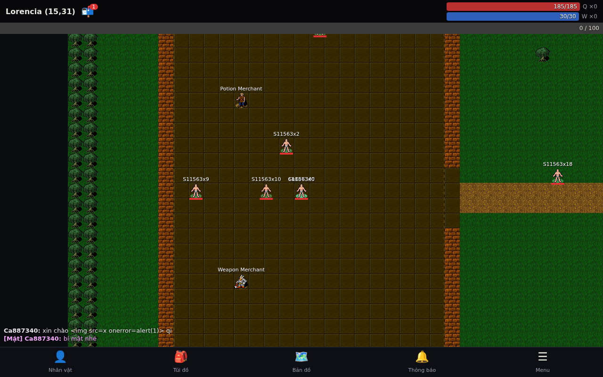

---

## 15. Mẹo cho người mới

1. Nhận ngay **"Diệt Nhện"** và **"Trưởng thành"** ở Quest Master (19, 25), rồi ra bãi Spider phía đông.
2. **Cộng điểm ngay khi lên cấp:**
   - DK: STR + VIT;
   - DW: ENE (thêm chút VIT);
   - ELF: AGI (ENE nếu chơi hỗ trợ);
   - MG: STR + ENE.
   Kiểm tra yêu cầu chỉ số của đồ sắp mặc.
3. Luôn mang bình **HP** (phím Q). HP không tự hồi.
4. Ép đồ lên **+6 bằng Bless không có rủi ro**. Từ +6 trở đi cân nhắc; +9 → +11 có thể **mất đồ**.
5. Đồ **+4 trở lên** + 1 Chaos đủ thử làm cánh cấp 1. Đồ cấp + càng cao, tỉ lệ càng tốt.
6. Cất jewel / đồ quý vào **kho** trước khi đi PvP (người Cảnh báo / Sát nhân có thể rơi đồ khi chết).
7. Lên **cấp 20** để mở khóa **MG** cho tài khoản.
8. Canh **Golden Invasion** (giờ chia hết cho 3 UTC) để lấy nhiều EXP / Zen / jewel.
9. Đi nhóm 3–5 người được tổng EXP nhiều hơn đánh một mình.

---

## 16. Câu hỏi thường gặp

**Nhân vật đứng yên không đi được?**
Có thể ô bạn bấm không đi tới được. Bấm chỗ khác. Nếu mất kết nối, màn hình hiện thanh trạng thái mạng; game tự kết nối lại.

**Bấm NPC không mở cửa hàng?**
Bạn đang là **Sát nhân** (tên đỏ). Chờ điểm PK giảm (1 điểm / 60 phút).

**Không qua được cổng Noria?**
Cần **cấp 10**.

**Không tạo được MG?**
Tài khoản cần một nhân vật **cấp 20**.

**Không mặc được món đồ?**
Thiếu cấp / chỉ số, hoặc sai lớp. Bấm vào món đồ xem yêu cầu (dòng đỏ là chưa đủ). MG không đội mũ.

**Ép đồ bị từ chối?**
Sai loại jewel cho cấp hiện tại (xem bảng 8.2), hoặc món đồ đã +11, hoặc đó là nhẫn.

**Đồ dưới đất không nhặt được?**
Đồ đang được giữ cho người khác (10 giây đầu), hoặc túi đầy.

**Chết có mất gì không?**
Chết vì quái: không mất gì. Bị người chơi giết khi bạn đang Cảnh báo / Sát nhân: có thể rơi 1 món.

**Gửi Zen cho nhân vật khác của mình thế nào?**
Kho không chứa Zen. Cách đơn giản: mua đồ ở cửa hàng rồi gửi kho cho nhân vật kia bán lại (giá bán = 50 % giá mua, nên sẽ hao).
