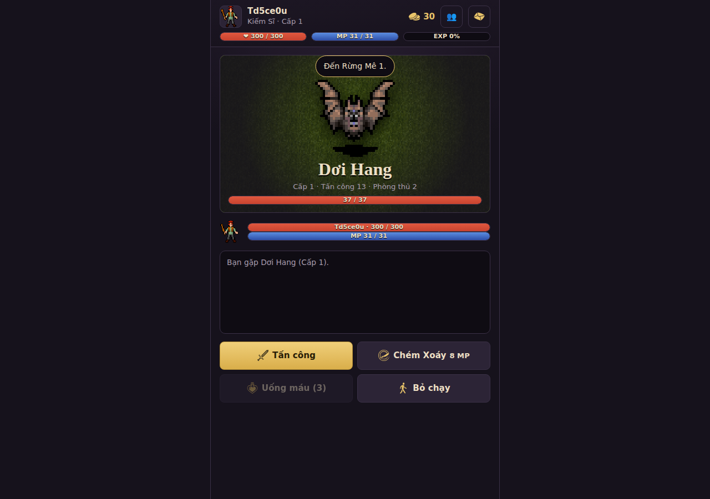
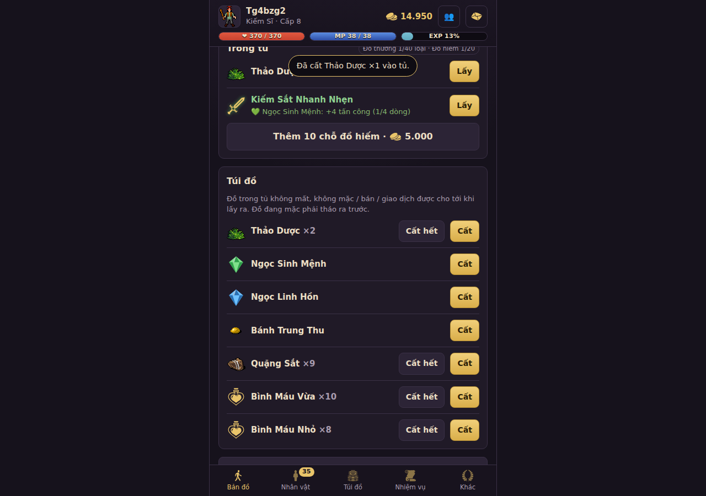
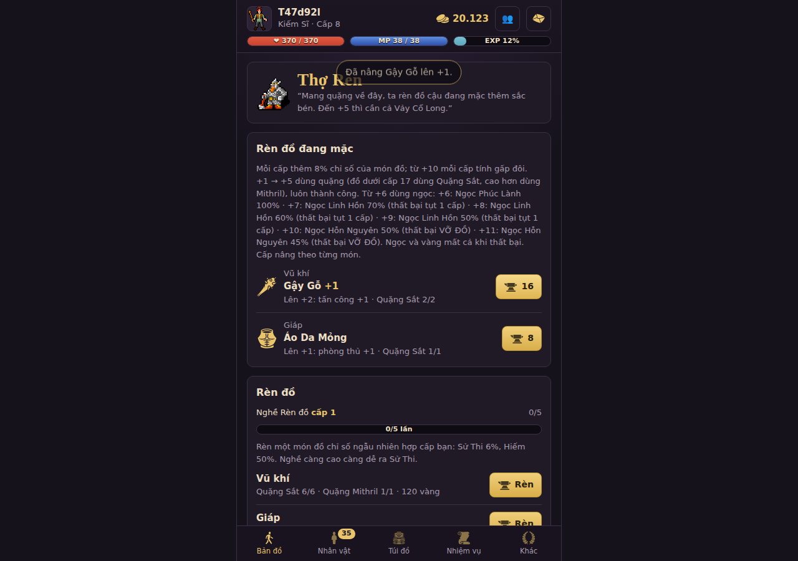
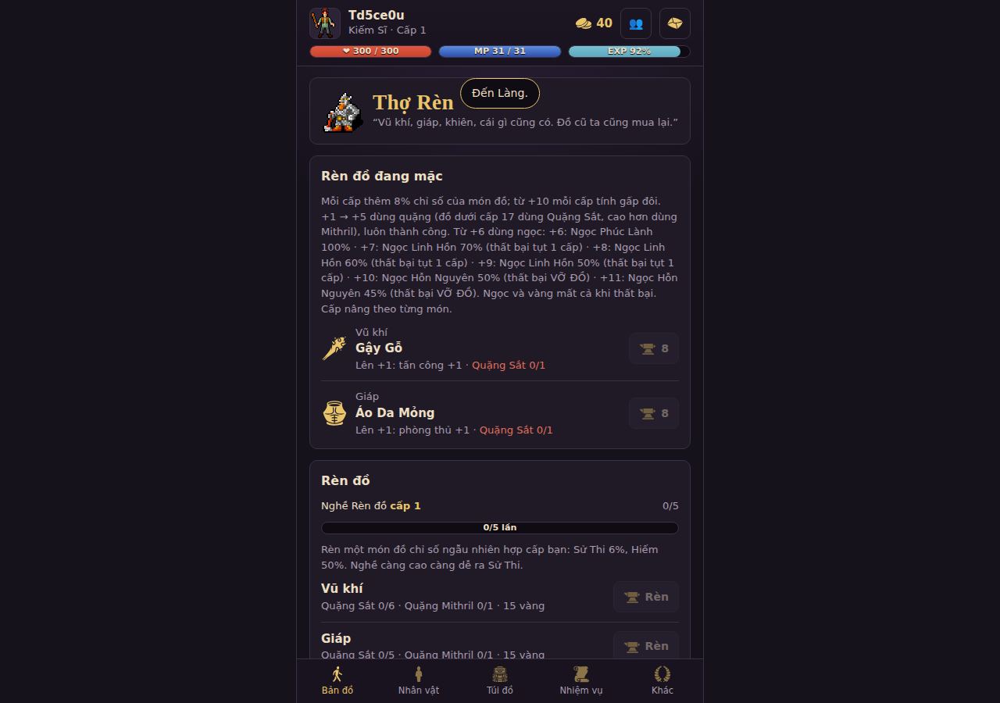
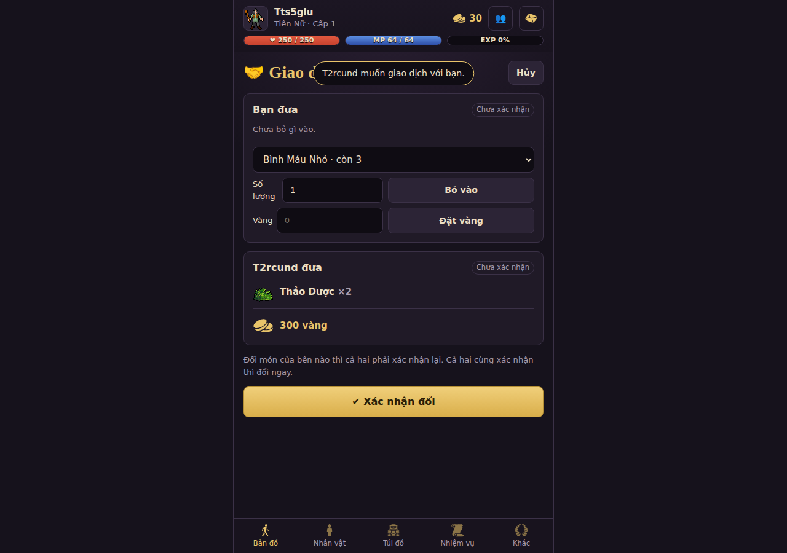
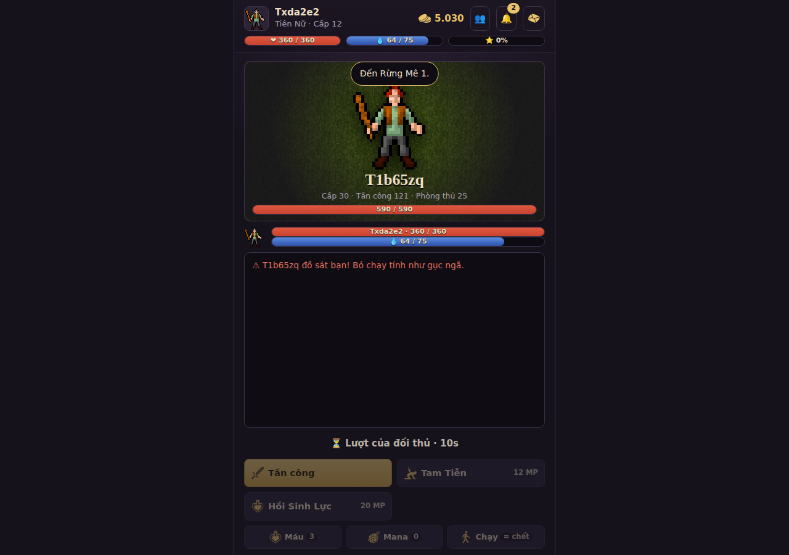
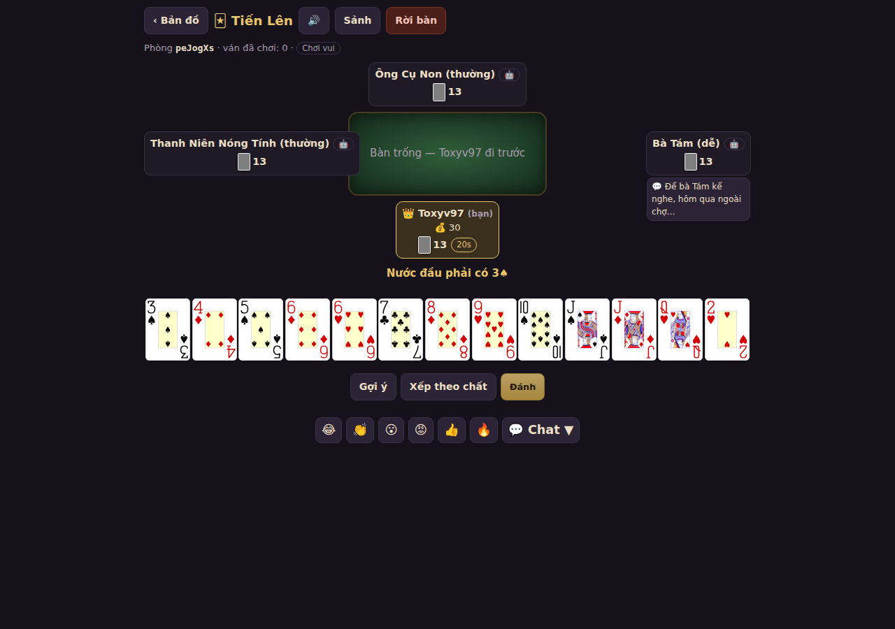
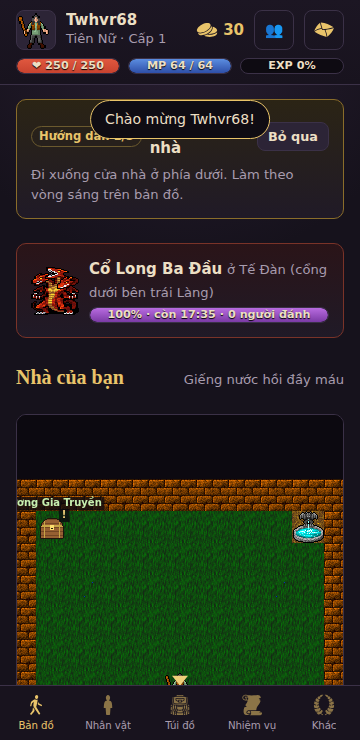

# Hướng dẫn người chơi — Hắc Long

> Hắc Long là game nhập vai chơi trên trình duyệt (máy tính và điện thoại). Rèn luyện qua sáu vùng đất, hạ các trùm canh
> giữ và tiêu diệt Hắc Long. Số liệu trong hướng dẫn này là số hiện tại của server; quản trị viên có thể chỉnh.

## Mục lục

1. [Bắt đầu](#1-bắt-đầu)
2. [Bốn lớp nhân vật](#2-bốn-lớp-nhân-vật)
3. [Chỉ số và lên cấp](#3-chỉ-số-và-lên-cấp)
4. [Bản đồ, vùng đất, trùm](#4-bản-đồ-vùng-đất-trùm)
5. [Đánh nhau](#5-đánh-nhau)
6. [Đồ đạc, túi, Tủ Đồ](#6-đồ-đạc-túi-tủ-đồ)
7. [Ép đồ, ngọc, Máy Hỗn Nguyên, cánh](#7-ép-đồ-ngọc-máy-hỗn-nguyên-cánh)
8. [Làng: NPC và việc hằng ngày](#8-làng-npc-và-việc-hằng-ngày)
9. [Nhà của bạn, thú cưng, câu cá, nấu ăn](#9-nhà-của-bạn-thú-cưng-câu-cá-nấu-ăn)
10. [Chơi cùng người khác](#10-chơi-cùng-người-khác)
11. [Đấu trường và Đồ sát](#11-đấu-trường-và-đồ-sát)
12. [Bang hội và chiến bang](#12-bang-hội-và-chiến-bang)
13. [Hộp thư, Thông báo, bảng xếp hạng](#13-hộp-thư-thông-báo-bảng-xếp-hạng)
14. [Phím tắt, điện thoại](#14-phím-tắt-điện-thoại)

---

## 1. Bắt đầu

- **Ngôn ngữ / Language:** nút English / Tiếng Việt ở trang đăng nhập và trong Menu → Cài đặt.
- Đăng ký tài khoản (tên đăng nhập + mật khẩu), đặt tên nhân vật (2–16 ký tự) và chọn lớp.
- Bạn bắt đầu ở **Nhà của bạn**. Đi qua cổng để ra **Làng**. Lần đầu chơi có **hướng dẫn tân thủ** (khung vàng phía trên bản
  đồ) dẫn từng bước và tặng quà khi xong; bấm "Bỏ qua" nếu không cần.
- Chạm (hoặc bấm) vào một ô trên bản đồ để đi tới; bước vào quái để đánh; bước vào NPC để nói chuyện.
- Thanh trên cùng (HUD): tên, cấp, vàng, máu (đỏ), MP (xanh), kinh nghiệm; nút 👥 bạn bè, 🔔 thông báo, ✉ hộp thư.
- Thanh dưới cùng (dock): **Bản đồ**, **Nhân vật**, **Túi đồ**, **Chọn map** (sắp có), **Menu** (Nhiệm vụ, Hành trình, Đấu trường,
  Xếp hạng, Bang hội, Thành tựu, Thú cưng, Kỹ năng, Sổ quái, **Cài đặt**: âm thanh, nhạc, đăng xuất, đổi mật khẩu…). Phím **Tab** mở Menu.

## 2. Bốn lớp nhân vật

| Lớp | Lối chơi | Kỹ năng (cấp mở) |
|---|---|---|
| **Kiếm Sĩ** | Cận chiến, máu và thủ dày. Tấn công theo Sức mạnh | Chém Xoáy (1), Trảm Choáng (10), Nộ Chiến (25) |
| **Phù Thủy** | Phép mạnh, máu mỏng. Tấn công theo Năng lượng | Cầu Lửa (1), Tia Sét (10), Khiên Linh Hồn (25) |
| **Tiên Nữ** | Cung, hồi máu, tăng sức. Tấn công theo Nhanh nhẹn | Tam Tiễn (1), Hồi Sinh Lực (10), Tăng Sức Mạnh (25) |
| **Đấu Sĩ** | Lai kiếm và phép (Sức mạnh + Năng lượng) | Kiếm Lửa (1), Kiếm Độc Hỏa (10), Phán Quyết (25) |

Kỹ năng tốn MP, tốn nhiều hơn khi lên cấp (MP gốc × (1 + 4 % × (cấp − 1))). Mỗi lượt trong trận hồi 3 % MP tối đa + Năng lượng / 10; nghỉ trọ hồi đầy. Kỹ năng luôn trúng (đòn thường có thể trượt).

Bình máu và **bình mana** (Bà Lang bán) hồi theo phần trăm: nhỏ 20 %, vừa 40 %, lớn 70 % máu / MP tối đa; giá tăng theo cấp nhân vật (+10 % mỗi cấp). Trong trận có nút **Uống máu** và **Uống mana** (mất một lượt).

## 3. Chỉ số và lên cấp

- Mỗi cấp được điểm tiềm năng. Cộng điểm ở tab **Nhân vật** (bấm + nhiều lần rồi xác nhận một lần):
  - **Sức mạnh**: tấn công (Kiếm Sĩ, Đấu Sĩ).
  - **Nhanh nhẹn**: chí mạng, né, phòng thủ, tỉ lệ trúng; tấn công của Tiên Nữ.
  - **Thể lực**: máu tối đa.
  - **Năng lượng**: MP; tấn công của Phù Thủy, Đấu Sĩ.
- Bảng nhân vật hiện tấn công thấp ~ cao (ví dụ "68 ~ 84"), phòng thủ, tỉ lệ trúng quái cùng cấp.
- Đánh quái thấp hơn mình quá 10 cấp thì kinh nghiệm giảm (mỗi cấp −10 %, còn tối thiểu 10 %): hãy lên vùng mới.
- **Chuyển sinh**: đạt cấp tối đa thì gặp Trưởng Làng để về cấp 1, giữ đồ, vàng, vùng đã mở, nhận thêm điểm tiềm năng vĩnh viễn.

## 4. Bản đồ, vùng đất, trùm

| Vùng | Cấp quái | Trùm |
|---|---|---|
| Rừng Mê | 1–5 | Sói Xám Đầu Đàn (6) |
| Trại Goblin | 6–11 | Tướng Orc (12) |
| Nghĩa Địa Cổ | 12–17 | Pháp Sư Bất Tử (18) |
| Núi Khổng Lồ | 18–23 | Vua Khổng Lồ (24) |
| Đầm Lầy Rồng | 24–29 | Kim Long (30) |
| Hang Hắc Long | 30–35 | **HẮC LONG** (36) |

- **Vùng mở theo cấp**: cấp nhân vật ≥ cấp quái thấp nhất của vùng là vào và đánh được, không cần hạ trùm trước.
- **Trùm vùng là thử thách có thưởng**: hạ lần đầu chắc chắn rơi một món đồ **Hiếm / Sử Thi đúng lớp** và nhận danh hiệu
  **Diệt <tên trùm>** (chọn ở tab Thành tựu); mỗi ngày lần đầu hạ một trùm được thêm ngọc (vùng 1–3: Ngọc Phúc Lành,
  vùng 4–6: Ngọc Linh Hồn). Hạ Hắc Long vẫn là đích cuối, lên bảng **Diệt rồng**.
- Chạm vào **đá dịch chuyển** để ghi nhớ, sau đó dịch chuyển nhanh từ đó.
- Gặp trùm là vào trận ngay như quái thường.
- **50 bản đồ phụ** (cấp quái 1–50, 10 nhóm: Đồng Cỏ Xanh, Rừng Thưa, Gò Kiến Đỏ, Đầm Sương, Cao Nguyên Tuyết, Thung Lũng U Linh, Mộ Cổ Hoang, Lò Nguyên Tố, Đỉnh Khổng Lồ, Vực Quỷ): vào bằng cổng xanh ở mép phải Rừng Mê 1, Rừng Mê 2, Trại Goblin 1–2, Nghĩa Địa Cổ 2, Núi Khổng Lồ 1–2, Đầm Lầy Rồng 2, Hang Hắc Long 1–2; mỗi nhóm 5 bản đồ nối tiếp nhau.
- **Chọn bản đồ** (phím **M** hoặc nút **Chọn map** trên dock): đủ cấp (cấp nhân vật ≥ cấp quái thấp nhất của bản đồ) và đủ vàng là dịch chuyển được, tốn 20 + 4 × cấp quái thấp nhất (Làng, Nhà miễn phí). Không cần mở vùng hay đi qua cổng trước.
- Ban đêm quái hiếm xuất hiện nhiều hơn. **Trùm thế giới Cổ Long** thỉnh thoảng xuất hiện ở Tế Đàn: cả server cùng đánh, thưởng
  theo sát thương (vắng mặt thì nhận qua thư).
- **Golden Invasion**: mỗi 2 giờ (0h, 2h, 4h… giờ Việt Nam) trong 15 phút, quái vàng (quầng vàng) xuất hiện ở bản đồ đầu
  mỗi vùng: mạnh hơn một chút, thưởng **×5**, dễ rơi ngọc, không hồi sinh. Hạ hết quái vàng một bản đồ thì **trùm vàng** xuất
  hiện (chắc chắn rơi ngọc). Dải vàng trên bản đồ cho biết giờ còn lại.
- **Tháp Vô Tận** (Người Gác Tháp ở Làng): mỗi tầng hạ hết quái để lên; cứ 5 tầng có trùm; máu không tự hồi trong tháp.

## 5. Đánh nhau

- Trận theo lượt: **Đánh**, **Kỹ năng**, **Uống máu**, **Chạy**. Số bay lên cho biết sát thương; "Trượt" là đòn hụt.
- Đòn có khoảng thấp ~ cao, có thể chí mạng; thủ của mục tiêu làm giảm sát thương nhưng không xuống dưới 20 % đòn gốc.
- Thắng nhận kinh nghiệm, vàng, có khi rơi đồ hoặc ngọc. Gục ngã thì về Nhà, mất 10 % vàng đang mang.
- **Hiệu ứng**: "LÊN CẤP" giữa màn hình khi lên cấp; số xanh khi hồi máu / MP; chữ lớn khi ép đồ thành công hay vỡ đồ.

## 6. Đồ đạc, túi, Tủ Đồ

- Tab **Túi đồ**: các ô trang bị (vũ khí, giáp, khiên, cánh…) và túi. Chạm một món để xem **bảng chi tiết**: chỉ số, so với đồ
  đang mặc, yêu cầu cấp; các nút **Trang bị / Tháo**, **🔒 Khóa** (đồ khóa không bán, rao chợ, giao dịch, vứt, bỏ vào máy ghép),
  **Ép** (chọn món để ép ở Thợ Rèn), **Vứt** (hỏi lại; nhiều món thì hỏi số lượng). Máy tính kéo thả được đồ lên ô trang bị.
- **Đồ theo lớp (Phase 15b):** 8 ô — vũ khí, khiên, cánh, mũ, giáp, quần, găng, giày (Đấu Sĩ không đội mũ). Mỗi lớp có vũ khí
  riêng (Kiếm Sĩ / Đấu Sĩ kiếm rìu, Phù Thủy gậy, Tiên Nữ cung nỏ) và bộ giáp riêng 6 bậc; mặc đủ bộ thì phòng thủ bằng tổng các
  món. Bảng chi tiết ghi **Dùng cho** (lớp) và **Cần** (Sức mạnh / Nhanh nhẹn… — đỏ khi thiếu, cộng điểm ở tab Nhân vật).
  Thợ Rèn chỉ bày đồ của lớp mình. Đồ cũ (Kiếm Sắt, Giáp Xích…) tự đổi sang món mới cùng bậc, giữ nguyên +N và khóa.
- **Nhẫn, dây chuyền, đồ Excellent, đủ bộ (Phase 15c):** 2 ô nhẫn (máu / thủ) và 1 ô dây chuyền (tấn công), chỉ rơi từ quái.
  Đồ **Excellent** (tên xanh lục) có thêm 1–3 dòng đặc biệt: tăng sát thương, chí mạng, hồi máu / MP khi hạ quái, máu tối đa,
  giảm sát thương nhận, vàng nhặt được. Mặc **đủ bộ giáp** từ bậc 2 trở lên được +10 % phòng thủ, +3 % tấn công và thêm máu
  (dòng "Bộ … 5/5 ✓" ở tab Túi đồ). Đồ có thêm bậc 7–8 cho cấp 27 và 32.
- **May mắn, Kỹ năng (Phase 15d):** đồ rơi đôi khi có dòng xanh dương **May mắn** (ép ngọc +7..+11 dễ thành công hơn 25 %;
  nếu là vũ khí thì thêm 5 % chí mạng) và vũ khí có thể có **Kỹ năng** (chiêu gây thêm 10 % sát thương). Đồ có các dòng này bán
  được giá hơn.
- **Cánh cấp 3, dòng cánh (Phase 15e):** từ cấp 45 ghép được cánh cấp 3 (cánh cấp 2 +9 trở lên + ngọc ở Máy Hỗn Nguyên),
  +25 % sát thương và −25 % sát thương nhận. Ghép thành công cánh cấp 2 / 3 còn được thêm một **dòng cánh** ngẫu nhiên: máu tối
  đa, MP tối đa hoặc bỏ qua một phần phòng thủ của đối thủ.
- **Máy Hỗn Nguyên pha đồ (Phase 15f):** Pha Excellent (thêm 1 dòng Excellent cho món +5 trở lên) và Pha May mắn (thêm May
  mắn cho món +3 trở lên). Thất bại thì mất món.
- **Đồ Bộ Thần (Phase 15g):** món bộ giáp rơi từ quái đôi khi là đồ Thần (tên cam, phòng thủ +20 %). Mặc 2 / 3 / đủ món Thần
  cùng bộ được thêm tấn công, phòng thủ, máu (dòng "Bộ Thần …" ở tab Túi đồ).
- **Quảng Trường Quỷ (Phase 18):** từ cấp 35, gặp Người Gác Tháp ở Làng. Mở 2 tiếng một lần (1h, 3h, 5h … 23h), cho vào
  trong 10 phút, mỗi lần mở vào một lần, tốn 1 Vé Quảng Trường (mua 20 000 vàng hoặc nhặt từ quái cấp 30+). 5 đợt quái
  trong 5 phút, đợt cuối có trùm; thưởng vàng, kinh nghiệm, ngọc theo điểm, qua hết đợt có thêm món đồ. Top 3 mỗi ngày
  nhận quà qua thư.
- **Lâu Đài Máu (Phase 18):** từ cấp 40, gặp Người Gác Tháp ở Làng. Mở 2 tiếng một lần (0h30, 2h30 … 22h30), cho vào
  trong 10 phút, mỗi lần mở vào một lần, tốn 1 Vé Lâu Đài (mua 30 000 vàng hoặc nhặt từ quái cấp 35+). Trong 8 phút: hạ 8
  quân canh, phá Cổng Thành, hạ Hiệp Sĩ Máu để nhận Lông Vũ Kền Kền (cần để ghép cánh cấp 3), vàng, kinh nghiệm, 2 ngọc.
- **Đồ hiếm** có chỉ số cộng thêm ngẫu nhiên, viền màu theo độ hiếm; túi giữ tối đa 20 món đồ hiếm.
- **Tủ Đồ** (trong Nhà): cất 40 loại đồ thường (không giới hạn số lượng mỗi loại) và 20 đồ hiếm; mở thêm 10 chỗ đồ hiếm × 3 lần
  bằng vàng (5 000 / 15 000 / 40 000). Đồ trong tủ không mất, nhưng không mặc / bán / giao dịch được cho tới khi lấy ra.

## 7. Ép đồ, ngọc, Máy Hỗn Nguyên, cánh

- **Thợ Rèn** (Làng), thẻ "Ép đồ": ép đồ đang mặc, hoặc đồ trong túi đã chọn bằng nút Ép.
  - +1 → +5: quặng (Quặng Sắt cho đồ dưới cấp 17, Mithril cho đồ cao hơn), luôn thành công.
  - +6: Ngọc Phúc Lành (100 %). +7 / +8 / +9: Ngọc Linh Hồn (70 / 60 / 50 %, thất bại tụt 1 cấp).
    +10 / +11: Ngọc Hỗn Nguyên (50 / 45 %, thất bại **vỡ đồ**, game hỏi lại trước khi ép).
  - Ngọc và vàng mất cả khi thất bại. Ép thành công từ +7 được báo cả server.
- **Ngọc Sinh Mệnh** 💚: thêm một dòng +4 tấn công (vũ khí) hoặc +4 phòng thủ (giáp, khiên, cánh), tối đa 4 dòng; tỉ lệ 50 %,
  thất bại mất một dòng.
- **Ngọc rơi** từ quái cấp 12 trở lên, trùm, Tháp Vô Tận, rương báu.
- **Máy Hỗn Nguyên** (Lão Hỗn Nguyên, Làng): ghép **cánh** (từ đồ +5 trở lên + ngọc + vàng; ép càng cao tỉ lệ càng tăng) và
  Ngọc Hỗn Nguyên. Thất bại mất hết nguyên liệu. **Cánh** cộng % sát thương và giảm % sát thương nhận.

## 8. Làng: NPC và việc hằng ngày

| NPC | Việc |
|---|---|
| Trưởng Làng | Nhiệm vụ (nhận, trả thưởng), chuyển sinh |
| Thợ Rèn | Mua / bán đồ, ép đồ, rèn đồ, rương báu |
| Bà Lang | Bình máu, pha chế từ thảo dược |
| Chủ Quán Trọ | Nghỉ một đêm: hồi đầy máu và MP |
| Bảng Tin | 4 việc hằng ngày, đổi mới mỗi ngày |
| Người Gác Tháp | Vào Tháp Vô Tận |
| Lão Hỗn Nguyên | Máy Hỗn Nguyên |
| Người Nuôi Thú, Thợ Mộc, Bác Đầu Bếp | Thú cưng, đồ trang trí Nhà, nấu ăn |
| Người Tổ Chức Hội | Đổi quà lễ hội (khi có sự kiện) |
| Chủ Chợ | Rao bán, mua đồ của người khác (phí 5 %, tiền bán gửi qua thư) |

## 9. Nhà của bạn, thú cưng, câu cá, nấu ăn

- **Nhà**: Rương Gia Truyền (quà mỗi ngày), Tủ Đồ, đặt đồ trang trí (mỗi 10 điểm tiện nghi +1 % kinh nghiệm, tối đa +5 %).
  Bạn bè có thể ghé thăm và khen nhà.
- **Thú cưng**: mua ở Người Nuôi Thú, hoặc hạ đủ số con một loài quái để thuần phục; thú đi theo và giúp một tay trong trận.
- **Câu cá** ở hồ, **hái thảo dược / quặng** ngoài vùng; **nấu ăn** ở Bác Đầu Bếp (món ăn cho hiệu ứng có hạn).

## 10. Chơi cùng người khác

- Chạm vào người chơi khác trên bản đồ để mở **bảng thông tin**: mời tổ đội, thăm nhà, giao dịch, kết bạn, thách đấu, đồ sát,
  chặn chat.
- **Màu tên trên bản đồ**: xanh lá = đồng đội, xanh dương = cùng bang, đỏ = bang đang chiến với bang bạn.
- **Tổ đội** (tối đa 3): đánh chung một con quái thì cùng thắng; mỗi người nhận thưởng × 1,2 / số người. Lời mời hết hạn sau
  30 giây; rời game quá 60 giây thì tự rời đội.
- **Giao dịch trực tiếp**: hai người đứng gần nhau (cùng bản đồ, cách ≤ 8 ô); mỗi bên đặt vàng / đồ, cả hai bấm Xác nhận thì đổi.
  Ai đổi món thì cả hai phải xác nhận lại. Tự hủy khi: lời mời quá 30 giây, mở quá 180 giây, một bên đổi bản đồ / vào trận /
  thoát game.
- **Chat**: khung chat ở góc dưới trái bản đồ (tin cũ mờ dần). Bấm nút **💬** (góc dưới phải) hoặc **Enter** để gõ, **Esc** để đóng,
  ▴ để xem lại lịch sử. Nút đổi kênh Tất cả / Bang / Đội, hoặc gõ lệnh:

  | Lệnh | Gửi tới |
  |---|---|
  | `/w Tên nội dung` | Tin riêng cho **bạn bè** tên đó |
  | `/p nội dung` | Tổ đội |
  | `/g nội dung` | Bang |
  | `/a nội dung` | Mọi người |

- **Bạn bè** (nút 👥): kết bạn theo tên, tin riêng, xem ai đang online.

## 11. Đấu trường và Đồ sát

- **Đấu trường** (tab Khác): đánh với **bản sao chỉ số** của người khác (họ không cần online). Điểm Elo lên / xuống; 15 trận mỗi
  ngày; thắng có ít vàng. Gục ngã tính như chết (mất vàng, về Nhà); bỏ chạy thì không mất gì.
- **🗡 Đồ sát** (PK): chạm tên người đang online **cùng bản đồ** → **🗡 Đồ sát**. Không cần người kia đồng ý: cả hai vào trận ngay,
  luân phiên lượt (người tấn công đi trước), mỗi lượt 10 giây, quá giờ thì tự đánh thường. Hết máu hoặc **bỏ chạy** là gục ngã:
  mất 10% vàng, về Nhà; số vàng đó về tay người thắng. Không đánh được ở Làng, Nhà và với người dưới cấp 10. Lịch sử ở thẻ Đấu trường.
  - Người vừa gục được **bảo vệ 2 phút**; mỗi giờ chỉ đồ sát cùng một người tối đa 3 lần.
  - Hạ người không tên đỏ thì bị **🔴 tên đỏ 30 phút** (cộng dồn). Tên đỏ mà gục thì mất **20%** vàng. Hạ người tên đỏ không bị đỏ tên.
  - Mỗi trận đồ sát được báo trên kênh thế giới.

### Tiến Lên Miền Nam (sòng bài ở Làng)

- Gặp **Bà Chủ Sòng** ở Làng (hoặc Menu → 🃏 Tiến Lên) để vào **sảnh**: danh sách bàn, mở bàn mới (mức cược, bàn
  riêng), vào bằng mã phòng, 📜 Ván đã chơi.
- Bàn 2–4 người. Chủ bàn (👑) thêm **máy** (dễ / thường) vào ghế trống, rồi bấm **Chia bài**. Bàn có máy chỉ
  **chơi vui** (cược 0).
- Chạm lá để chọn, **Gợi ý** chọn sẵn nước đánh được (bấm tiếp để đổi). Nút **Đánh** ghi lý do khi chưa đánh được
  (sai bộ, chưa đủ lớn…). **Chặt ngoài lượt!** hiện khi bạn cầm bốn đôi thông chặt được.
- Luật như bản gốc: 3 → 2, ♠ < ♣ < ♦ < ♥; chặt heo / chặt chồng; tới trắng (tứ quý heo, sáu đôi, sảnh rồng,
  tứ quý 3 ván đầu); mỗi lượt 20 giây (hết giờ server đánh thay); rời bàn / mất kết nối quá 20 giây giữa ván là
  bị loại (tính Bét).
- **Cược S vàng**: cần ít nhất 10×S vàng mới được chia bài. Bét trả Nhất S (4 người: Ba trả Nhì S/2); chặt heo
  đen 1×S, đỏ 2×S (chặt chồng nhân lên); thối heo khi về chót; tới trắng mỗi người trả 2×S. Thiếu vàng thì trả
  tối đa số đang có.
- Ném 🍅 1 · 🥚 2 · 🩴 3 · 🌹 5 vàng vào ghế người khác (bấm vào ghế); biểu cảm, chat bàn, câu nhanh; 😮‍💨 thổi bài
  (cho vui, không đổi gì).
- **Mời bạn**: lúc bàn đang chờ có ghế trống, bấm **👥 Mời bạn** → chọn bạn bè (🟢 đang online). Bạn nhận thông báo
  **🃏 Vào bàn** (và tin riêng có nút đó, kể cả khi đang offline); bấm là ngồi vào bàn.
- **Xem trận**: bấm 👀 Xem ở sảnh (không thấy bài ai). **Xem lại ván**: 📜 Ván đã chơi → ▶ Xem lại (thấy hết bài).

## 12. Bang hội và chiến bang

- Lập bang (5 000 vàng, tên 3–20 ký tự, ký hiệu 2–4 chữ in hoa) hoặc tìm bang để vào / xin vào. Góp vàng vào quỹ để bang lên cấp
  (thêm chỗ, thêm % kinh nghiệm). Nhiệm vụ bang hằng tuần thưởng quỹ và quà cho mọi thành viên.
- Vai trò: bang chủ, **tối đa 2 phó bang** (duyệt đơn, đuổi thành viên thường, sửa thông báo), thành viên. Đơn xin vào quá
  7 ngày tự bỏ.
- **Chiến bang**: bang chủ / phó bang nhập ký hiệu bang địch → Tuyên chiến; bang kia (chủ / phó online) có 60 giây để nhận.
  Trận kéo dài 1 giờ: mỗi lần bạn thắng thành viên bang địch ở **đấu trường** được +1 điểm cho bang (mỗi đối thủ tính tối đa
  3 lần). Bang thắng: quỹ +5 000, ai ghi điểm nhận 500 vàng qua thư. Đầu hàng được; hai bang chỉ chiến lại sau 24 giờ.

## 13. Hộp thư, Thông báo, bảng xếp hạng

- **Hộp thư** (✉): quà vắng mặt, tiền bán chợ, quà quản trị, thưởng bang. Lọc Tất cả / Chưa đọc / Có quà; **Nhận tất cả**;
  **Xóa thư đã đọc**. Giữ 100 thư; thư quá 30 ngày tự xóa, **trừ thư còn quà chưa nhận**.
- **Thông báo** (🔔): giữ lại các tin đáng nhớ — lên cấp, ép / ghép thành công hay thất bại, thư mới, lời mời, kết quả cược, tin
  hệ thống. Số đỏ là tin chưa xem; "Xóa hết" để dọn. Danh sách lưu trên trình duyệt đang dùng (tối đa 50 tin).
- **Bảng xếp hạng** (tab Khác): Cấp cao (chọn được từng lớp, có hạng của bạn trong lớp), Săn nhiều, Tháp, Diệt rồng, Bang, Bang
  diệt Cổ Long, Đấu trường. Bảng làm mới mỗi phút.

## 14. Phím tắt, điện thoại

- Máy tính: **C** Nhân vật, **I** Túi đồ, **M** Chọn bản đồ, **Q** uống bình máu, **Enter** gõ chat, **Esc** đóng bảng đang mở.
- Điện thoại: mọi thao tác bằng chạm; nút đủ lớn, không cần kéo ngang.
- Nút **⤢** góc trên phải bản đồ: thu cả bản đồ cho vừa khung (bấm lại để tắt).
- **Menu → Cài đặt → Bản đồ**: Sáng / Tối / Tự động (theo giờ trong game).
- Dock **👫 Quanh đây**: số người chơi khác đang cùng bản đồ (người khác không vẽ trên bản đồ); chạm tên để xem **hồ sơ** và giao dịch, kết bạn, thách đấu, đồ sát. Hồ sơ của mình: tab Nhân vật → **📜 Hồ sơ**.
- Quái có tên trên đầu và thanh máu dưới chân; quái đang bị người khác đánh (⚔) hiện máu còn lại cho mọi người.
- **Menu → 📚 Thư viện**: tra cứu bản đồ (cấp quái, cổng, NPC), quái (chỉ số, nơi xuất hiện, đồ rơi), vật phẩm (chỉ số, nơi có được); gõ tên không cần dấu.
- Bấm lại icon đang mở trên dock để đóng, về bản đồ. Nói chuyện NPC: nút **‹ Bản đồ** ở trên cùng.
- Chat: tin mới hiện 5 giây ở góc dưới trái rồi ẩn (bấm 💬 xem hết); gõ **/d** để xóa chat trên máy mình.

